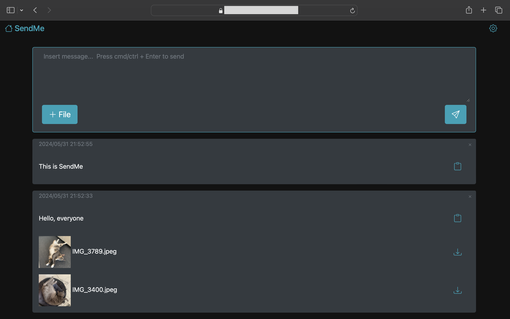

# SendMe

#### Introduction

##### What is it?

SendMe is a web-based application designed for storing and sharing information files. Simply open the webpage and log in, and you'll have a space to store and access your information or file across different devices and operating systems.

##### Why?

In everyday life, we often need to transfer screenshots, URLs, images, or files between different devices. This usually requires other applications and pre-installed software on each device. SendMe aims to eliminate this dependency, allowing you to share information across devices and operating system through a web page without needing additional software.

---
#### Features

- Simple communication across different operating systems
- No installation required; just open the webpage
- One-click upload
- Login history; no need to log in repeatedly
- Support for various file types, including images
- File download capability
- One-click text copying
- One-click deletion
- Real-time synchronization

---
#### Installation

Currently, the SendMe server is hosted on AWS EC2, with files stored on AWS S3, so it cannot be used directly on a local machine. To run it locally, you would need to change the database location, making it possible to use your local machine as the server.

---
#### Purpose

The development of SendMe aims to familiarize with full-stack development, web frameworks, cloud operations, CI/CD, and pipelines, while solving practical everyday scenarios.

---

#### Implementation

- **Frontend**: Built with basic CSS, JavaScript, and Bootstrap to create a simple interface.
- **Backend**: Developed with Flask to handle CRUD operations and authentication, using sessions to store cookies and avoid repeated logins. Flask-SocketIO is used for real-time synchronization.
- **SQL database**: MongoDB was chosen for storing non-relational data such as text snippets, file names, or URLs. SQLite was used to manage account credentials, providing easy management and querying.
- **Cloud**: Files are stored on AWS S3, with the server hosted on AWS EC2. File information is stored in MongoDB, deployed using Docker. Integrated with Github Actions to automate deployment through git push commands. Security environment variables are stored separately in a .env file to ensure privacy concern.

---
#### Design Debates

##### Web Framework Choice

Between Django and Flask, Flask was chosen for its suitability for quick development. However, as the project grew, the code became more cluttered. Next time, Django will be considered for the web framework.

##### Frontend Framework

To get familiar with full-stack development, the frontend was built with basic HTML, CSS, JavaScript, and Bootstrap. In the future, a frontend framework like React, Vue, or Angular will be considered.

##### Cloud Deployment

AWS was chosen for the first cloud deployment experience to learn more about cloud deployment details and regulations. Files are stored on S3 because it has no storage limit, though a 20MB limit per file was set to control costs. The server is hosted on EC2 for fast data transfer between S3 and EC2, and to gain deeper insight into the AWS ecosystem.

##### CI/CD Pipeline

Initially, Jenkins was used for automated deployment management, but Github Actions was later chosen due to storage considerations. For small projects, Github Actions is very useful, monitoring git push commands and automating the deployment process by connecting to the server, executing git clone to replace new files, and running Docker Compose to set up the server and MongoDB server. 

##### Why Not Use Docker Images to Deploy Directly?

To protect sercurity information, Docker containers are set up and run on the server rather than using publicly accessible Docker images. Sensitive information is uploaded separately and not shared through Github.

---
#### Workflow

File change -> git commit -> git push -> (if environment variables change, upload .env file to overwrite the server's original file) -> Github Actions handles the remaining deployment tasks.

---
### Summary:

- I now have an overview of the full-stack process, which will make it easier to understand other projects in the future. 
- Writing unit tests after completing the code can be difficult to organize, so next time I will write tests immediately after finishing a feature. 
- The code optimization and organization were insufficient, so I plan to use Django next time to better understand how to allocate tasks. 
- Some features, like pagination and date search, were not included, but the basic functionality is complete.